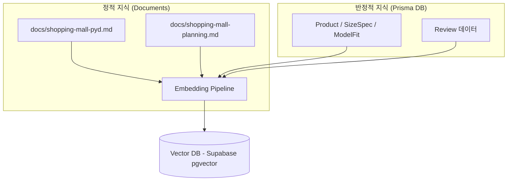
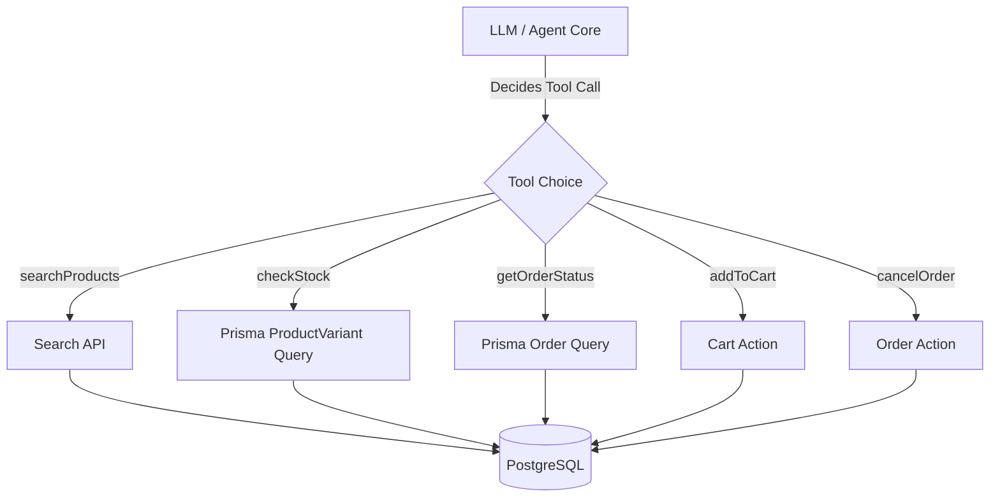
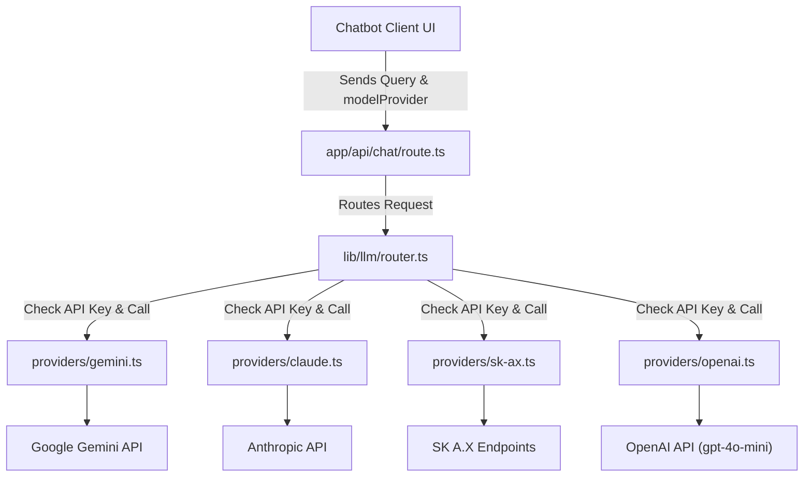

# Shopping Mall Chatbot RAG Agent Architecture

본 문서는 남성 컨템포러리 패션 쇼핑몰 브랜드 **"SLOWEON"**의 챗봇 에이전트 도입을 위한 RAG(Retrieval-Augmented Generation) 및 Tool-using Agent 시스템의 아키텍처 설계서입니다. 현재 구축되어 있는 Next.js 15 및 Supabase/Prisma 기반의 데이터 모델과 비즈니스 로직을 온전히 활용하여 실재적으로 구현할 수 있는 상세 명세를 기술합니다.

---

## 1. 목적

### 1.1 해결하려는 문제
SLOWEON의 주요 고객군(프로젝트 기획 문서 [customer-personas.md](file:///Users/6_month/sk-project/docs/customer-personas.md)에 정의되어 실존하는 공식 페르소나 김도현, 박준서, 이태오, 최민재)은 구매 결정 과정에서 다음과 같은 대표적인 문제(마찰)를 겪습니다.
1. **사이즈 결정 장애**: 운동형 체형, 넓은 허벅지/어깨 등으로 인해 기존 사이즈 표와 착용 모델컷만으로는 실제 핏을 확신하지 못해 이탈 또는 반품 피로를 겪음 (최민재, 박준서).
2. **스타일링 및 코디 고민**: 컨템포러리 패션 스타일을 시도하고 싶으나 옷 입는 법이나 색상/소재 조합에 자신이 없어 완제품 셋업이나 착장 조합 추천을 요구함 (김도현).
3. **실시간 정보 탐색 피로**: 특정 상품의 실시간 재고(색상/사이즈 단위), 신규 드롭 상품 일정, 품절 상품의 재입고 일정 등을 빠르게 알기 원함 (이태오).
4. **단순 배송/교환/환불 절차 확인**: 구매 완료 후 배송 진행 상태를 조회하거나 교환/반품 규정을 확인하고 직접 신청하길 바람 (박준서).

### 1.2 RAG + Tool-using Agent의 필요성
단순 룰 기반 FAQ 챗봇은 위 문제를 해결할 수 없습니다. 
- **RAG가 필요한 이유**: 배송/환불 규정, 세탁법, 스타일 가이드 등 비정형 텍스트 지식(FAQ)뿐만 아니라, **구조화된 상품 메타데이터(소재, 핏, 디자인 의도)** 및 **수백 개의 고객 착용 리뷰 데이터(키, 몸무게, 핏 피드백)**를 맥락적으로 검색하여 "178cm/72kg 평소 100 입는데 이 셔츠 M이 맞을까요?"와 같은 자연어 질문에 데이터 기반의 상세한 조언을 제공하기 위함입니다.
- **Tool-using Agent가 필요한 이유**: RAG는 과거의 정적 데이터 검색에 최적화되어 있어, "현재 이 바지 차콜 L 사이즈 재고가 있나요?", "내 주문 배송 상태를 보여줘"와 같은 **실시간 트랜잭션 데이터(재고, 배송 상태)** 조회가 불가능합니다. 따라서 LLM이 실시간 DB를 조회하거나 장바구니 담기, 주문 취소 등의 비즈니스 작업을 직접 기동(Tool Calling)하도록 설계하여 능동적인 에이전트를 구축해야 합니다.

### 1.3 Multi-Model Provider 선택 및 에이전트별 모델 정책
본 챗봇은 사용자가 선호하는 LLM 모델(Gemini, Claude, SK A.X, OpenAI)을 드롭다운에서 직접 선택하여 대화할 수 있는 **Multi-Model Provider** 기능을 제공합니다. 그러나 비즈니스 리스크 관리와 응답 일관성을 위해 에이전트 종류에 따라 다음과 같이 모델 선택 정책을 차별화합니다.

1. **Classification Agent (의도 분류 에이전트)**: 
   - 정책: 사용자가 선택한 모델 대신 **가장 빠르고 비용이 저렴한 고정 기본 모델 (예: Gemini 1.5 Flash)**을 서버에서 상시 사용합니다.
   - 이유: 단순 의도 분류 및 키워드 파싱에 높은 비용의 모델이나 응답 지연이 큰 모델을 쓸 필요가 없기 때문입니다.
2. **Answer Agent (자연어 답변 에이전트)**:
   - 정책: **사용자가 선택한 모델 (Gemini / Claude / SK A.X / OpenAI)**을 적극 활용하여 답변을 생성합니다.
   - 이유: 각 모델별 고유의 톤앤매너(Claude의 정밀함, Gemini의 창의성, SK A.X의 우수한 한국어 뉘앙스 처리, OpenAI의 균형 잡힌 고성능 등)에 대한 사용자 취향을 존중하기 위함입니다.
3. **Refund Decision Agent (환불 판정 에이전트)**:
   - 정책: 사용자가 선택한 모델의 자동 판정을 전면 배제하며, **서버 정책으로 고정된 특정 안정성 특화 모델**을 활용하여 판정 조력자로만 기능하고 최종 결정은 **DB 상태와 관리자 승인 플로우**를 강제합니다. OpenAI를 선택했더라도 대화창 내 자동 환불/주문취소/결제취소 처리는 결코 수행되지 않습니다.
   - 이유: 모델의 성능 차이로 인해 승인 여부가 달라지는 비일관성을 방지하고, 악의적 환불 시도로부터 시스템을 보호하기 위함입니다.


---

## 2. 현재 프로젝트 구조 분석

현재 쇼핑몰은 Next.js 15 (App Router), Prisma, Supabase PostgreSQL로 구축되어 있으며, 주요 코드 위치와 챗봇 관련성은 다음과 같습니다.

### 2.1 주요 코드 및 DB 스키마 매핑
| 구분 | 파일 및 경로 | 설명 및 챗봇 연계 방안 |
|---|---|---|
| **DB Schema** | [`web/prisma/schema.prisma`](file:///Users/6_month/sk-project/web/prisma/schema.prisma) | - `User`: 사용자 기본 신체 스펙(height, weight)을 활용해 최적 사이즈 추천 시 실시간 반영<br>- `Product`, `ProductVariant`: 상품 기본 정보 및 실시간 재고(`stock`) 확인에 연계<br>- `SizeSpec`, `ModelFit`: 사이즈 실측치 및 모델 피팅 데이터로 RAG의 주요 지식원<br>- `Review`: 고객 체형별 핏 피드백(`fitFeedback`) 및 리뷰 텍스트 분석에 활용<br>- `Order`, `Payment`, `OrderStatusHistory`: 개인 주문 및 배송 상태 실시간 조회를 위한 도구 데이터 소스<br>- `Address`: 사용자 배송지 조회/등록 도구 연계 |
| **비즈니스 Action** | [`web/src/app/actions/`](file:///Users/6_month/sk-project/web/src/app/actions) | - `auth.ts`: `login`, `logout`, `signup` 등 회원 가입/로그인 액션 호출 도구<br>- `order.ts`: `prepareOrder`, `cancelOrder` 등 주문/취소 액션 호출 도구<br>- `cart.ts`: `addToCart` 등 장바구니 적재 액션 호출 도구<br>- `restock.ts`: 품절 상품에 대한 재입고 알림 신청 호출 도구<br>- `review.ts`: 상품 리뷰 조회 및 요약 도구<br>- `claim.ts`: 교환/반품 신청 접수 도구 |
| **인증 유틸** | [`web/src/lib/auth.ts`](file:///Users/6_month/sk-project/web/src/lib/auth.ts) | - 챗봇 세션에서 `userId`를 검증하고, 개인 주문 조회나 장바구니 담기 시 보안 가드를 적용하는 인증 모듈 |
| **에셋 경로** | [`web/src/lib/assets.ts`](file:///Users/6_month/sk-project/web/src/lib/assets.ts) | - 챗봇 응답 시 추천하는 상품의 이미지 URL을 CDN 또는 Next.js public 경로로 매핑하여 제공할 때 활용 |

---

## 3. Knowledge Base 구성

RAG를 구축하기 위해 수집, 정제하여 Vector DB에 적재할 Knowledge Base(지식 베이스)는 크게 세 가지 범주로 구성됩니다.



### 3.1 정보원별 수집 범위 및 스키마 연계
1. **상품 상세 정보 (Product)**
   - 연계 필드: `Product.id`, `name`, `koreanName`, `color`, `material`, `fit`, `designNotes`, `stylingNotes`, `shortDescription`, `price`.
   - 구성: 상품 하나를 단위로 하여 디자인 의도, 소재의 특징, 추천 코디(stylingNotes)를 설명하는 마크다운 텍스트 문서 청크를 생성.
2. **실측 사이즈 및 모델 피팅 스펙 (SizeSpec & ModelFit)**
   - 연계 필드: `SizeSpec` (어깨, 가슴, 소매, 총장 등), `ModelFit` (모델 키, 몸무게, 착용 사이즈, fitComment).
   - 구성: "상품 ID: `top_01`은 M 사이즈 기준 어깨 50cm, 가슴 58cm이며, 185cm/73kg 모델이 L 사이즈를 세미오버 핏으로 착용했습니다."와 같이 템플릿화된 자연어 텍스트로 가공하여 청킹.
3. **고객 착용 리뷰 피드백 (Review)**
   - 연계 필드: `Review.rating`, `content`, `height`, `weight`, `fitFeedback` (`SMALL` | `JUST` | `LARGE`), `purchasedSize`.
   - 구성: 상품별로 핏 피드백 분포를 요약한 텍스트 구축. (예: "`top_01` 상품의 경우 175cm~180cm, 70kg~75kg 체형의 고객들이 M 사이즈를 입었을 때 주로 '정사이즈(JUST)'로 피드백했습니다.")
4. **쇼핑몰 운영 및 CS 정책 (Markdown)**
   - 연계 파일: `docs/shopping-mall-pyd.md` 및 `docs/shopping-mall-planning.md` 내의 텍스트.
   - 구성: 배송 정책(배송비 3,000원, 10만원 이상 무료, 평균 2~3일 소요), 교환/환불 정책(배송 완료 후 7일 이내 신청 가능, 단순 변심 시 왕복 배송비 6,000원), 회원 웰컴 혜택(10% 할인 쿠폰 발급, 결제액 1% 적립)을 헤더 단위로 분할하여 구축.

---

## 4. Indexing Pipeline

정적/반정적 텍스트 데이터를 임베딩하여 Vector DB에 주기적으로 갱신해 주는 인덱싱 파이프라인의 설계 구조입니다.

```
[Prisma DB / Markdown Files] 
       │
       ▼ (Data Extraction & Cleaning)
[Text Preprocessing] (HTML 태그 제거, 템플릿 결합)
       │
       ▼ (Chunking)
[Semantic / Hybrid Chunking] (정책: 300~500 tokens / 상품: 1상품 1청크)
       │
       ▼ (Embedding Generation)
[Embedding Model: text-embedding-3-small]
       │
       ▼ (UPSERT with Metadata)
[(Vector DB) Supabase PostgreSQL pgvector]
```

### 4.1 Chunking & Metadata Strategy
- **상품 데이터 Chunking**: 상품 데이터는 속성 간 유기적인 연계가 중요하므로 잘게 쪼개지 않고 **1상품 1청크** 원칙을 고수합니다. 하나의 상품 메타데이터와 실측표, 모델 피팅 정보를 단일 마크다운 포맷 템플릿으로 구조화하여 청크를 생성합니다.
  - *Metadata*: `productId` (String), `category` ("top" | "bottom"), `status` ("ON_SALE" | "SOLD_OUT"), `price` (Int), `color` (String)
- **정책 문서 Chunking**: 대제목/소제목 구조를 유지하는 **Parent-Child Chunking**을 적용하여 약 300~500 토큰 단위로 나눕니다. 문맥이 끊기지 않도록 50~100 토큰의 오버랩(Overlap) 영역을 설정합니다.
  - *Metadata*: `category` ("shipping" | "return" | "membership" | "faq"), `source` ("shopping-mall-pyd.md")

### 4.2 Embedding & Vector DB 저장 (미구현)
- **임베딩 모델**: OpenAI `text-embedding-3-small` (1536차원) 또는 동급의 한국어 지원 모델을 사용하여 텍스트 데이터를 벡터화할 예정입니다. **[미구현]**
- **Vector DB 스키마**: Supabase PostgreSQL의 `pgvector` 확장을 사용하며, Prisma Schema 상에서 이를 관리할 수 있는 `VectorIndex` 모델을 제안합니다. **[미구현]**

```prisma
// 챗봇 RAG용 벡터 테이블 (미구현 - schema.prisma에 추가 및 마이그레이션 예정)
model VectorIndex {
  id        String   @id @default(cuid())
  chunkId   String   @unique
  content   String   // 실제 텍스트 내용
  category  String   // product | policy | faq
  metadata  Json     // 필터링용 메타데이터 (productId, price, color 등)
  embedding Unsupported("vector(1536)")? // pgvector 매핑
  createdAt DateTime @default(now())
  updatedAt DateTime @updatedAt

  @@index([category])
}
```
*(참고: Prisma에서 `Unsupported("vector(1536)")` 필드를 사용하고, 실제 조회 및 생성은 Raw Query(`$queryRaw`)로 처리합니다.)*

---

## 5. Retrieval Pipeline

사용자의 질문을 해석하여 최적의 컨텍스트를 찾아 LLM에 전달하기까지의 검색 파이프라인 구조입니다.

```
[User Input Query] 
       │
       ▼
[Intent Classifier & Entity Extractor] 
       ├─► (Intent: 상품 추천/검색) ──► Metadata Filter 추출 (예: 가격 <= 5만원, 색상="블랙")
       ├─► (Intent: 개인화 Action) ──► 세션 토큰 확인 & API / Tool direct routing
       └─► (Intent: 정책/FAQ)      ──► 필터 없음
       │
       ▼
[Hybrid Retrieval (Dense + Sparse Search)]
       - Dense: Cosine Similarity on pgvector
       - Sparse: BM25/Prisma Full-text Search (koreanName, name 대상)
       - Apply Metadata Filters
       │
       ▼
[Reranking Layer (Cohere Rerank / Cross-Encoder)]
       - 검색된 Top-20 후보들의 의미론적 연관성 재정렬
       │
       ▼
[Top-K Context Selection] 
       - LLM 프롬프트에 주입할 최적의 Context 3~5개 확정
```

### 5.1 Retrieval 상세 로직
1. **Intent 분류**: LLM에게 사용자의 의도(Intent)를 분류하도록 유도하거나 경량화된 NLU 분류기를 사용하여 질문의 성격을 `PRODUCT_SEARCH`, `POLICY_INQUIRY`, `ORDER_CHECK`, `GENERAL_FAQ`로 태깅합니다.
2. **Metadata Filtering**: 
   - 사용자가 "5만원대 차콜색 바지 있어?"라고 물으면, Intent 분류기에서 `price_max: 60000`, `color: "차콜"`, `category: "bottom"` 필터를 추출합니다.
   - Vector DB 검색 시 `metadata ->> 'color' = '차콜'` 및 `(metadata ->> 'price')::int <= 60000` 제약 조건을 추가하여 정교한 검색 결과를 보장합니다.
3. **Hybrid Search**: pgvector를 이용한 코사인 유사도 검색과 PostgreSQL Full-Text Search를 1:1 비중으로 융합(RRF - Reciprocal Rank Fusion)하여, 고유명사(예: "오버사이즈 워크 셔츠")와 추상적 질의(예: "편하고 시원한 상의") 모두에서 높은 검색 정확도를 달성합니다.

---

## 6. Policy Layer (정책 레이어)

챗봇 에이전트의 안전하고 신뢰성 높은 작동을 위해 반드시 준수해야 하는 동작 정책(Policy)입니다.

- **Retrieval Policy (조회 정책)**: 
  - 개인 주문 내역, 배송지 주소 등 민감한 개인정보는 LLM의 RAG 데이터에 절대 인덱싱하지 않습니다.
  - 조회가 필요할 경우, 클라이언트 쿠키에서 추출한 HttpOnly 세션(`tokenHash`)을 해독하여 `userId`가 일치하는 본인의 실시간 DB 레코드만 Tool을 통해 접근하도록 제한합니다. 타인의 주문 조회를 시도하면 즉시 거절합니다.
- **Recommendation Policy (추천 정책)**:
  - 품절 상품(`status = "SOLD_OUT"` 또는 Variant 총 재고가 `0`)은 RAG 컨텍스트에서 제외하거나 추천 목록에서 원천 배제합니다.
  - SLOWEON의 미니멀 컨템포러리 무드를 반영하여, 화려한 원색이나 캐주얼한 스트릿 룩보다는 "차분한 톤온톤 셋업", "정돈된 실루엣" 위주로 제안하고, 룩북(`/lookbooks`) 페이지와 연동된 착장 세트를 우선적으로 추천합니다.
- **Business Policy (비즈니스 정책)**:
  - 배송 기간, 교환/환불 배송비 등은 항상 `docs/`에 공식 기술된 값만 답변하며, 임의로 무료 배송 혜택을 연장하거나 할인을 약속하는 구두 보상을 전면 금지합니다.
- **Order Policy (주문/취소 정책)**:
  - 주문 상태가 `"PAID"`(결제 완료)인 경우에만 챗봇을 통한 즉시 취소(`cancelOrder`) 처리가 가능합니다. `"PREPARING"`(배송 준비 중) 이상인 경우에는 취소가 불가하고 "마이페이지 반품 신청 절차"로 넘어가도록 명확히 한계를 둡니다.
- **Privacy/Security Policy (개인정보 보호 정책)**:
  - 사용자가 대화창에 주민등록번호, 계좌/카드 비밀번호 등을 입력하는 것이 탐지되면 즉시 마스킹 처리하고, "개인 정보 유출 위험이 있으니 민감 정보 입력을 삼가달라"는 시스템 경고를 출력합니다.
- **Fallback Policy (예외 처리 정책)**:
  - 검색 스코어가 임계치(예: 코사인 유사도 0.70) 이하이거나, 사용자의 불만 제기 톤이 감지될 경우, 더 이상 환각(Hallucination) 답변을 하지 않고 **"죄송합니다. 요청하신 내용은 명확한 규정을 확인하기 어렵습니다. 상세한 안내를 위해 고객센터(1:1 문의 게시판) 또는 카카오톡 상담원으로 연결해 드리겠습니다."**라는 멘트와 함께 상담 연결 링크 또는 API를 트리거합니다.
- **Response Policy (응답 톤앤매너 정책)**:
  - 남성 컨템포러리 편집숍의 정체성에 맞는 절제되고 정중한 존댓말(해요체와 하십시오체의 적절한 조화)을 사용하며, 이모티콘의 과도한 사용을 지양합니다.

---

## 7. Agent Tools (에이전트 도구 - 미구현)

현재 구축된 파일 및 API를 기반으로, 향후 에이전트가 연동하여 인자를 채워 호출할 수 있도록 설계된 도구 목록입니다. **[전원 미구현 - 구현 예정]**



### 7.1 상세 도구 정의

#### 1. `searchProducts`
- **목적**: 사용자가 원하는 조건(카테고리, 가격대, 색상, 키워드)에 맞는 상품 목록을 검색합니다.
- **입력값**:
  - `categorySlug` (String, Optional) - "top" | "bottom"
  - `color` (String, Optional)
  - `maxPrice` (Int, Optional)
  - `query` (String, Optional)
- **출력값**: 관련 상품 객체 배열 (`id`, `koreanName`, `price`, `color`, `status`)
- **호출 조건**: "시원한 차콜색 바지 보여줘", "5만원 이하 셔츠 추천해줘" 등의 상품 탐색 질의 시.
- **관련 파일/API 위치**: [`web/src/app/products/page.tsx`](file:///Users/6_month/sk-project/web/src/app/products/page.tsx)의 필터 쿼리 로직 재사용.

#### 2. `getProductDetail`
- **목적**: 특정 상품의 상세 설명, 소재, 실측 사이즈표, 모델 피팅 스펙을 조회합니다.
- **입력값**: `productId` (String, Required) - 예: "top_01"
- **출력값**: 상품 상세 정보(소재, 실측 스펙 `SizeSpec` 리스트, 모델 피팅 `ModelFit` 정보)
- **호출 조건**: "이 셔츠 소재가 뭐야?", "M 사이즈 총장이 어떻게 돼?"와 같이 특정 상품 정보를 캐물을 때.
- **관련 파일/API 위치**: DB `Product` 조회 쿼리 및 [`web/prisma/schema.prisma`](file:///Users/6_month/sk-project/web/prisma/schema.prisma)의 `Product` - `SizeSpec` / `ModelFit` 릴레이션 조회.

#### 3. `checkStock`
- **목적**: 특정 상품의 옵션(색상, 사이즈)별 실시간 재고 수량을 확인합니다.
- **입력값**: 
  - `productId` (String, Required)
  - `size` (String, Required)
- **출력값**: `stock` (Int), `status` (String - "ON_SALE" | "SOLD_OUT")
- **호출 조건**: "이 셔츠 L 사이즈 재고 남아있나요?" 등 구매 직전 재고 확인 시.
- **관련 파일/API 위치**: [`web/prisma/schema.prisma`](file:///Users/6_month/sk-project/web/prisma/schema.prisma) 내 `ProductVariant` 테이블 단건 조회.

#### 4. `getUserOrders`
- **목적**: 현재 로그인된 사용자의 최근 주문 및 결제 내역 목록을 조회합니다.
- **입력값**: 없음 (세션 기반 `userId` 내부 주입)
- **출력값**: 주문 내역 배열 (`orderNumber`, `status`, `totalProductAmount`, `createdAt`, 상품명 요약)
- **호출 조건**: "최근에 주문한 거 잘 들어갔나요?", "내 주문 내역 보여줘" 등 본인의 주문 확인 요구 시.
- **관련 파일/API 위치**: [`web/src/app/actions/order.ts`](file:///Users/6_month/sk-project/web/src/app/actions/order.ts) 내 `getMyOrders` (또는 유사 쿼리).

#### 5. `getOrderStatus`
- **목적**: 특정 주문 건의 상세 배송 진행 상태 및 트래킹 정보를 조회합니다.
- **입력값**: `orderNumber` (String, Required)
- **출력값**: `orderNumber`, `status` ("PAID" | "PREPARING" | "SHIPPED" | "DELIVERED" 등), 배송지 정보, 상태 변경 내역
- **호출 조건**: "주문번호 OOO 배송 시작했나요?", "택배 언제 와요?" 등 배송 상태 추적 시.
- **관련 파일/API 위치**: [`web/src/app/actions/order.ts`](file:///Users/6_month/sk-project/web/src/app/actions/order.ts) 내 주문 상세 단건 조회 API.

#### 6. `addToCart`
- **목적**: 선택한 상품 옵션을 사용자의 장바구니에 추가합니다.
- **입력값**: 
  - `variantId` (String, Required)
  - `quantity` (Int, Optional, 기본값 1)
- **출력값**: `success` (Boolean), `cartItemId` (String)
- **호출 조건**: "이 셔츠 M 사이즈 장바구니에 넣어줘"라고 직접 담기 대행을 요구할 때.
- **관련 파일/API 위치**: [`web/src/app/actions/cart.ts`](file:///Users/6_month/sk-project/web/src/app/actions/cart.ts) 내 `addToCart` Server Action.

#### 7. `cancelOrder`
- **목적**: 아직 배송이 시작되지 않은 주문을 취소하고 결제 취소를 트리거합니다.
- **입력값**: `orderId` (String, Required)
- **출력값**: `success` (Boolean), `message` (String)
- **호출 조건**: "방금 주문한 거 취소해 주세요"라고 취소 대행을 요구할 때.
- **관련 파일/API 위치**: [`web/src/app/actions/order.ts`](file:///Users/6_month/sk-project/web/src/app/actions/order.ts) 내 `cancelOrder` Server Action.

---

## 7.2 Multi-Model Provider 어댑터 아키텍처

다양한 모델 프로바이더를 서버 단에서 매끄럽게 연결하고 추상화하기 위해 Provider-Adapter 아키텍처를 적용합니다.



- **`web/src/lib/llm/router.ts`**:
  - 클라이언트에서 전송한 `modelProvider` 인자를 검증하고 기본값(`gemini`)을 보정합니다.
  - 선택된 Provider의 서버 환경변수 존재 여부를 사전에 파악하여, 키 누락 또는 호출 실패 시 API 원문 에러를 감추고 정제된 공통 에러 문구(`현재 선택한 AI 모델을 사용할 수 없습니다. 다른 모델을 선택하거나 잠시 후 다시 시도해 주세요.`)를 출력하며 Fallback 작동을 제어합니다.
- **`web/src/lib/llm/providers/gemini.ts`**:
  - Vercel AI SDK(`ai`, `@ai-sdk/google`)를 활용해 Gemini 1.5 Flash를 실행하고, 도구(Tool Calling) 연동을 전담합니다.
- **`web/src/lib/llm/providers/claude.ts`**:
  - `ANTHROPIC_API_KEY` 환경변수를 이용해 Claude 3.5 Sonnet API 엔드포인트를 호출하는 HTTP 어댑터입니다.
- **`web/src/lib/llm/providers/sk-ax.ts`**:
  - `SK_AX_API_KEY`와 `SK_AX_BASE_URL` 환경변수를 참조해 SK A.X Llama3 한국어 특화 모델을 찌르는 OpenAI 호환 HTTP 어댑터입니다.
- **`web/src/lib/llm/providers/openai.ts`**:
  - `OPENAI_API_KEY` 환경변수를 이용해 OpenAI 모델(`gpt-4o-mini` 기본 고정 상수) API를 호출하는 HTTP 어댑터입니다.


---

## 8. Generation Layer

임베딩 검색 결과(RAG Context)와 실행된 API 도구 결과(Tool Output)를 취합하여 자연스럽고 정교한 마크다운 응답으로 합성하는 층입니다.

### 8.1 LLM Prompt 구조 가이드라인
```
[System Prompt]
너는 남성 컨템포러리 패션 브랜드 "SLOWEON"의 인공지능 쇼핑 어시스턴트다. 
아래 가이드라인에 따라 정중하고 세련된 말투로 대답하라.
- 모르는 정보나 지식 베이스에 없는 정책을 유추해서 확답하지 마라. 모르면 반드시 상담원 연결을 제안하라.
- 품절된 상품은 추천하지 마라.
- 개인정보가 입력된 경우 필터링하라.

[User Session Info]
- User ID: clu... (로그인 상태)
- User Profile: 키 176cm, 몸무게 71kg (존재 시 제공)

[RAG Context]
- 배송 정책: 10만원 이상 무료배송. 3시 이전 당일 출고.
- size_spec of top_01: M사이즈 총장 72cm, 가슴 56cm.

[Tool Execution Result]
- getProductDetail("top_01"): { stock: 5, status: "ON_SALE" }

[User Query]
"저 176에 70킬로인데 top_01 셔츠 M사이즈 사면 어떨까요? 그리고 배송은 언제 되나요?"
```

### 8.2 응답 템플릿 예시 (목업 기반 예시)
*(주의: 아래 템플릿은 향후 LLM 연동 시 생성될 응답의 목업 예시이며, 실제 테스트 및 작동 결과가 아닙니다.)*
- **상품 추천 및 사이즈 조언**:
  ```markdown
  고객님의 체형(176cm/70kg)을 고려했을 때, **[오버사이즈 코튼 셔츠 (Charcoal)](/products/top_01)** M 사이즈를 추천해 드립니다. 
  
  M 사이즈 실측은 총장 72cm, 가슴 단면 56cm로 설계되어 고객님께서 편안한 세미오버 실루엣으로 입으실 수 있습니다. 실제로 유사한 체형의 다른 고객님들께서도 90% 이상 '정사이즈로 잘 맞는다'는 피드백을 남겨주셨습니다.
  
  현재 해당 상품의 M 사이즈는 재고가 소량(5개) 남아 있어 즉시 주문이 가능합니다.
  ```
- **주문/배송 및 정책 안내**:
  ```markdown
  주문하신 상품은 영업일 기준 오후 3시 이전에 결제가 완료되면 당일 발송 처리가 시작됩니다. 
  고객님의 주문 건([주문번호: 20260703-0001](/mypage/orders/20260703-0001))은 현재 **배송 준비 중(PREPARING)** 상태이며, 오늘 저녁 택배사로 인계될 예정입니다. 발송이 시작되면 알림톡으로 운송장 정보를 송부해 드리겠습니다.
  ```

---

## 9. Guardrails (가드레일 및 방어 로직)

잘못된 응답이나 악성 대화를 필터링하기 위한 다중 가드 레이어 설계입니다.

1. **환각 필터링 (Strict Context-Grounding)**
   - LLM 생성 직후, 응답에 포함된 명사/수치(예: "배송비 2,500원")가 입력된 RAG Context에 존재하는지 검사하는 NLI(Natural Language Inference) 판정기 또는 프롬프트 검증 2단계를 도입합니다. Context에 존재하지 않는 정보라면 출력을 차단하고 Fallback 문구를 보냅니다.
2. **품절 추천 원천 차단**
   - 추천할 상품 리스트를 LLM에 전달하기 전, API 단에서 실시간 재고가 0이거나 단종된 variant 상품은 프롬프트의 추천 후보군 리스트에서 제거하여 입력 정보 자체를 통제합니다.
3. **개인정보 감지 및 필터 (PII Masking)**
   - 대화창 입력란 및 LLM 출력 텍스트에 대해 정규표현식(`/\d{6}-\d{7}/`, `/\d{4}-\d{4}-\d{4}-\d{4}/` 등)을 이용해 주민등록번호, 카드번호, 계좌번호 등이 인지될 경우 자동으로 `[MASKED]`로 변경 처리합니다.
4. **금융/거래 위험 통제**
   - 결제, 환불 승인, 결제수단 변경 등의 거래 데이터 조작은 챗봇 LLM의 응답에서 텍스트로 처리되지 않으며, 사용자에게 공식 마이페이지 링크([주문 취소 링크](file:///Users/6_month/sk-project/web/src/app/mypage/orders/page.tsx))를 주거나 실제 토스페이먼츠 SDK 기동 페이지로 사용자를 안전하게 Redirect시키는 방식으로 제약합니다.
5. **가드레일 (모르면 상담원 연결)**
   - "모르는 내용이나 매뉴얼 외적인 질문(예: 주식 투자 조언, 타사 제품 비교 등)을 받았을 때는 단정하여 답변하지 말고, **'이해를 돕기 위해 상담원 연결을 도와드리겠습니다.'** 혹은 **'고객센터 1:1 게시판을 이용해 달라'**로 대응한다"는 원칙을 하드코딩된 Fallback 핸들러에 삽입합니다.
6. **보안 및 모델 가드레일 (추가 정책)**
   - **API Key 노출 전면 금지**: API Key는 절대 클라이언트(브라우저)로 다운로드되거나 노출되지 않으며, 오직 서버 환경변수로만 사용되고 검증됩니다. `NEXT_PUBLIC_` 접두사를 붙인 브라우저 환경변수 사용은 엄격히 차단됩니다.
   - **에러 메시지 원문 노출 차단**: LLM 프로바이더 장애 시 출력되는 원시 스택 트레이스나 API 에러 코드는 클라이언트에 노출하지 않으며, 무조건 규정된 공통 오류 안내 문구(`현재 선택한 AI 모델을 사용할 수 없습니다. 다른 모델을 선택하거나 잠시 후 다시 시도해 주세요.`)로 마스킹합니다.
   - **민감 비즈니스 로직 고정 모델 및 검증 우선**: 환불 판정(Refund Decision)이나 주문 데이터 상태 조작은 사용자 선택 모델 단독 판단으로 수행하지 않고, 서버의 지정 안전성 모델 검토와 DB 정합성, 관리자 직접 승인 플로우를 최우선으로 하여 자동 처리 비즈니스 리스크를 차단합니다. OpenAI 등 외부 고성능 범용 모델을 선택했더라도, 자동 환불/주문취소/결제취소 행위는 DB 상태 검증과 사전에 수립된 안전한 서버 액션(Server Actions) 파이프라인을 통하지 않고서는 절대 실행되지 않습니다.


---

## 10. 구현 로드맵

현재 구축된 소스 코드를 바탕으로 한 챗봇 및 RAG 시스템 구축 단계적 일정안입니다.

### 10.1 1단계: 바로 추가 가능한 것 (현재 미구현, 즉시 구현 착수 가능)
- **Next.js API Route 신설**: `/api/chat` Route Handler를 개설하여 클라이언트와 스트리밍 대화를 나눌 수 있는 엔드포인트 마련. **[미구현]**
- **Vercel AI SDK 연동**: `@ai-sdk/openai` 또는 `@google/genai-sdk` 패키지를 설치하여 Gemini 1.5 Flash/Pro 등과의 연결부 설정. **[미구현]**
- **RAG 지식 문서 생성**: `docs/shopping-mall-pyd.md` 및 `shopping-mall-planning.md`를 바탕으로 `docs/faq-knowledge.json`과 같은 반정적 RAG 지식 청크 데이터셋을 파싱 스크립트로 신속하게 작성. **[미구현]**

### 10.2 2단계: DB 및 API 수정이 필요한 것 (현재 미구현)
- **Supabase pgvector 활성화 및 스키마 반영**: Prisma Schema에 `VectorIndex` 모델을 반영하고 Supabase 데이터베이스에 `CREATE EXTENSION IF NOT EXISTS vector;` 마이그레이션 실행. **[미구현]**
- **인덱싱 스크립트 작성**: 상품 DB 테이블(`Product`, `SizeSpec` 등)의 변화를 감지해 주기적으로 pgvector에 임베딩을 UPSERT하는 배치 스크립트(`scripts/sync-vectors.ts`) 개발. **[미구현]**
- **채팅 이력 DB화**: 사용자의 챗 세션 유지와 대화 내역 저장을 위한 `ChatSession`, `ChatMessage` 스키마 추가 및 마이그레이션. **[미구현]**

### 10.3 3단계: Agent Tools 및 Guardrail 연동 (현재 미구현, 고도화 단계)
- **Prisma Action Wrapper Tool 개발**: `order.ts`, `cart.ts` 등의 Server Action 로직을 LLM이 해석할 수 있는 JSON Schema 규격의 `Agent Tools`로 랩핑. **[미구현]**
- **유저 세션 보안 장치 구축**: 쿠키 세션을 연동하여 비회원이 회원용 Tool 호출을 시도하지 못하도록 라우팅 가드 구축. **[미구현]**
- **가드레일 모니터링**: 챗봇 답변 실패 로그를 DB(`ChatFailureLog`)에 감사 로그 형식으로 기록하여, RAG 청크 보완에 피드백 루프로 활용. **[미구현]**

---

## 11. 추천 디렉토리 구조 (미구현 - 구조 제안)

프로젝트 루트 하위에 RAG 및 Agent 기능을 확장할 때 추천되는 구조입니다. **[전원 미구현 - 구현 예정]**

```
web/
├── prisma/
│   └── schema.prisma         # VectorIndex, ChatSession, ChatMessage 스키마 추가
├── scripts/
│   └── sync-vectors.ts       # DB 데이터 -> Vector DB 정기 동기화 CLI 스크립트
└── src/
    ├── app/
    │   ├── api/
    │   │   └── chat/
    │   │       └── route.ts  # LLM 스트리밍 및 Tool Calling 제어 Route Handler
    │   └── chatbot/
    │       └── page.tsx      # 데스크톱 전용 챗봇 풀스크린 페이지 (선택)
    ├── components/
    │   └── chatbot/
    │       ├── ChatBubble.tsx      # 플로팅 챗봇 대화방 버블 컴포넌트
    │       ├── ChatMessageItem.tsx # 메시지 카드, 상품 카드 렌더러
    │       └── ChatInput.tsx       # 인풋 및 파일(이미지) 업로드 폼
    └── lib/
        ├── agent/
        │   ├── prompts.ts    # System Prompt, Guardrail Prompt 관리
        │   └── scheduler.ts  # 대화 문맥 만료 관리
        ├── rag/
        │   ├── vectorDb.ts   # pgvector 쿼리 (Similarity Search) 유틸
        │   └── embedder.ts   # text-embedding-3-small API 호출 유틸
        └── tools/
            ├── productTools.ts  # searchProducts, getProductDetail, checkStock
            ├── orderTools.ts    # getUserOrders, getOrderStatus, cancelOrder
            └── cartTools.ts     # addToCart, addToWishlist
```

본 추천 디렉토리는 기존 Next.js 15의 App Router 규칙을 철저히 따르며, 결합도를 낮추고 결함이 생겼을 때 쉽게 격리할 수 있도록 RAG, Agent, Tools의 레이어를 완전히 분리 설계한 것입니다.

---

## 12. 기능 구현 상태 요약표

현재 쇼핑몰 챗봇 RAG/Agent 기능의 구현 단계를 분류한 요약표입니다.

| 대분류 | 기능/모듈 항목 | 관련 소스코드 위치 | 현재 상태 | 상세 설명 및 기구현 리소스 |
| :--- | :--- | :--- | :--- | :--- |
| **현재 구현된 기능** | 회원/인증 비즈니스 로직 | [`web/src/app/actions/auth.ts`](file:///Users/6_month/sk-project/web/src/app/actions/auth.ts) | **구현 완료** | 로그인, 로그아웃, 회원가입, 세션 기반 토큰 인증 관리 |
| | 장바구니 비즈니스 로직 | [`web/src/app/actions/cart.ts`](file:///Users/6_month/sk-project/web/src/app/actions/cart.ts) | **구현 완료** | 게스트/회원 장바구니 조회, 추가, 수량 변경, 병합 |
| | 주문/결제 비즈니스 로직 | [`web/src/app/actions/order.ts`](file:///Users/6_month/sk-project/web/src/app/actions/order.ts) | **구현 완료** | 가주문 생성, 주문 확정, 결제 취소, 주문 내역 조회 |
| | CS 및 클레임 비즈니스 로직 | [`web/src/app/actions/claim.ts`](file:///Users/6_month/sk-project/web/src/app/actions/claim.ts), `restock.ts` | **구현 완료** | 주문 교환/반품 신청 접수, 상품 재입고 알림 신청 |
| | 상품 및 리뷰 데이터베이스 | [`web/prisma/schema.prisma`](file:///Users/6_month/sk-project/web/prisma/schema.prisma) | **구현 완료** | 상품 40개 시드 데이터, 사이즈 실측표, 모델 피팅, 리뷰 테이블 완비 |
| **설계만 완료된 기능** | RAG/Agent 아키텍처 정립 | [`docs/shopping-mall-chatbot-rag-agent.md`](file:///Users/6_month/sk-project/docs/shopping-mall-chatbot-rag-agent.md) | **설계 완료** | 전체 시스템 구성도, 데이터 흐름, 로드맵, 예외 처리 설계 |
| | RAG 정책 및 가드레일 정의 | [`docs/shopping-mall-chatbot-rag-agent.md#6-policy-layer`](file:///Users/6_month/sk-project/docs/shopping-mall-chatbot-rag-agent.md#L156) | **설계 완료** | 개인정보 마스킹, 상담원 Fallback, 품절 차단 가이드라인 수립 |
| | Agent Tools 명세 기획 | [`docs/shopping-mall-chatbot-rag-agent.md#7-agent-tools`](file:///Users/6_month/sk-project/docs/shopping-mall-chatbot-rag-agent.md#L179) | **설계 완료** | `searchProducts` 등 7개 도구의 입출력 파라미터 규격 설정 |
| **구현 필요한 기능** | Supabase pgvector 활성화 | [`web/prisma/schema.prisma`](file:///Users/6_month/sk-project/web/prisma/schema.prisma) | **미구현** | Supabase `vector` 확장 모듈 활성화 및 VectorIndex 마이그레이션 |
| | 임베딩 및 인덱싱 파이프라인 | `web/scripts/sync-vectors.ts` | **미구현** | DB 상품 데이터 정기 추출, 임베딩 모델 호출 및 벡터 DB UPSERT 동기화 |
| | 대화 기록/세션 DB 스키마 | `web/prisma/schema.prisma` | **미구현** | 대화 세션 및 히스토리 저장을 위한 Prisma 스키마 추가 및 배포 |
| **구현 완료된 기능 (MVP)** | LLM Route Handler API | [`web/src/app/api/chat/route.ts`](file:///Users/6_month/sk-project/web/src/app/api/chat/route.ts) | **구현 완료** | Vercel AI SDK + LLM Router 연동 및 Mock Fallback 탑재 완료 |
| | 챗봇 프론트엔드 UI 컴포넌트 | [`web/src/components/chatbot/ChatBot.tsx`](file:///Users/6_month/sk-project/web/src/components/chatbot/ChatBot.tsx) | **구현 완료** | Floating Bubble UI, 메시지 리스트, 입력창, 상품 카드 파싱 렌더링 완료 |
| | Agent Tools 실코드 랩핑 | [`web/src/lib/tools/productTools.ts`](file:///Users/6_month/sk-project/web/src/lib/tools/productTools.ts) | **구현 완료** | 4대 툴(Search, Detail, Stock, AddCart) Prisma & Server Action 연동 랩핑 완료 |
| | Multi-Model Selector 컴포넌트 | [`web/src/components/chatbot/ModelSelector.tsx`](file:///Users/6_month/sk-project/web/src/components/chatbot/ModelSelector.tsx) | **구현 완료** | Gemini, Claude, SK A.X, OpenAI 선택 UI 및 챗봇 연계 완료 |
| | LLM Router & Provider 어댑터 | [`web/src/lib/llm/router.ts`](file:///Users/6_month/sk-project/web/src/lib/llm/router.ts) | **구현 완료** | modelProvider별 라우팅 및 환경변수 보안 검증, 에러 마스킹 구현 완료 (OpenAI 어댑터 포함) |

